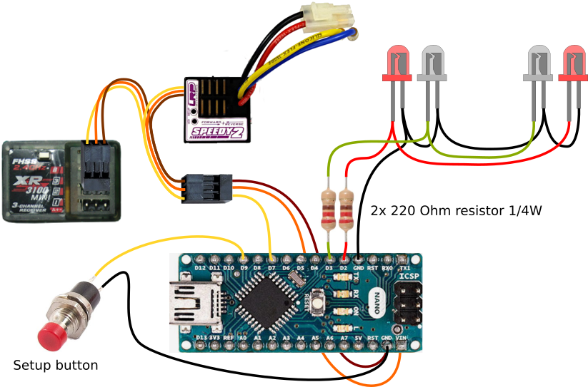

# RC Brake & Reversing Light controller

This project is a simple light controller for Radio Controlled cars that simulates realistic brake and reversing lights.

It hooks between your ESC and receiver.

The brake lights automatically turn on for a short, random time when the throttle goes to neutral. The reversing lights turn on when driving backwards.

The light controller supports various ESC modes to ensure the lights are in sync with the way your ESC controls the drive motor.

This project was derived from a smaller version using an inexpensive microcontroller from STC: [RC-brake-lights](https://github.com/laneboysrc/rc-brake-lights)

If you are looking for more than just brake lights check out our full-featured [DIY RC Light Controller](https://github.com/laneboysrc/rc-light-controller).

## Loading the firmware

This project requires the PinChangeInterrupt library. You can install this library from the Library manager within the Arduino IDE.

Open the [rc-brake-lights-arduino.ino](rc-brake-lights-arduino/rc-brake-lights-arduino.ino) in the Arduino IDE, connect your Arduino, select the proper board type, and press the Upload button.

This project was tested on an Arduino Nano.

## Connecting the light controller to your RC system

The light controller makes use of the following pins on the Arduino:

* Brake light LED: `D2`
* Reversing light LED: `D3`
* Throttle signal from the receiver: `D7`
* Setup switch: `D9`

If required, you can change those pins in the file [global.h]((rc-brake-lights-arduino/global.h)

Connect the throttle signal from your receiver to the Arduino pin `D7`. You may need a Y-cable so that you can connect both the ESC and the Arduino.

Output `D2` drives two red LEDs in parallel for the brake light function.
Output `D3` drives two white LEDs in parallel for the reversing light function.

Connect a push button between pin `D9` and `GND`.

## Forward/Reverse setup

Depending on your RC system, out of the box the light controller may operate in the wrong direction (forward and backward reversed). To change this, press and hold the setup button on the light controller for 3 seconds. The LEDs will start flashing quickly.

Now move the throttle on the transmitter to the driving direction that would make the car move `forward`. When LEDs will go out and the light controller has now learned the correct direction of the throttle signal for `forward`. This setting is preserved, so you only have to do this once.

## Changing the ESC mode

When it comes to brake function, ESC models behave differently. The light controller can be programmed for the specific behavior of your ESC.

To change the ESC mode, perform the following steps:
Press and hold the setup button on the light controller. After 3 seconds, the LEDs will start to flash quickly. Press the setup button one more time. The light controller enters the ESC mode setting and flashes the current ESC mode number:

##### 1 flash: Forward/Brake/Reverse with timeout
When driving forward and then immediately pushing the throttle to reverse, the ESC performs a brake function. The ESC only allows driving backwards if the ESC has remained in neutral position for a few seconds.

Example: The China 320A ESC, HPI SC-15WP

##### 2 flashes: Forward/Brake/Reverse
After going forward and then into reverse, the ESC always performs the brake function -- even if the throttle remained in neutral for a long time.

Example: Tamiya ESCs

##### 3 flashes: Forward/Reverse (Crawler mode)
Crawler ESC with drag brake, where the ESC switches from forward directly
into reverse.

##### 4 flashes: Forward/Brake
ESC in race mode where reversing is not allowed.

Press the setup button repeatedly until the desired ESC mode has been selected. Then press-and hold the setup button until the LEDs stop flashing. The ESC mode has now been persistently stored.

